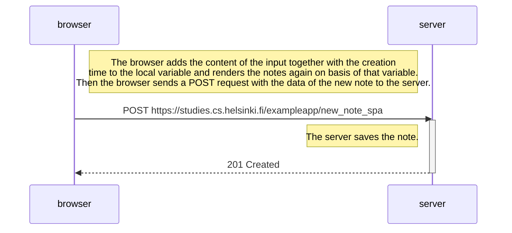

```mermaid
sequenceDiagram
    participant browser
    participant server

    Note right of browser: The browser adds the content of the input together with the creation<br> time to the local variable and renders the notes again on basis of that variable.<br> Then the browser sends a POST request with the data of the new note to the server.

    browser->>server: POST https://studies.cs.helsinki.fi/exampleapp/new_note_spa
    activate server

    Note left of server: The server saves the note. 

    server-->>browser: 201 Created
    deactivate server

   
```